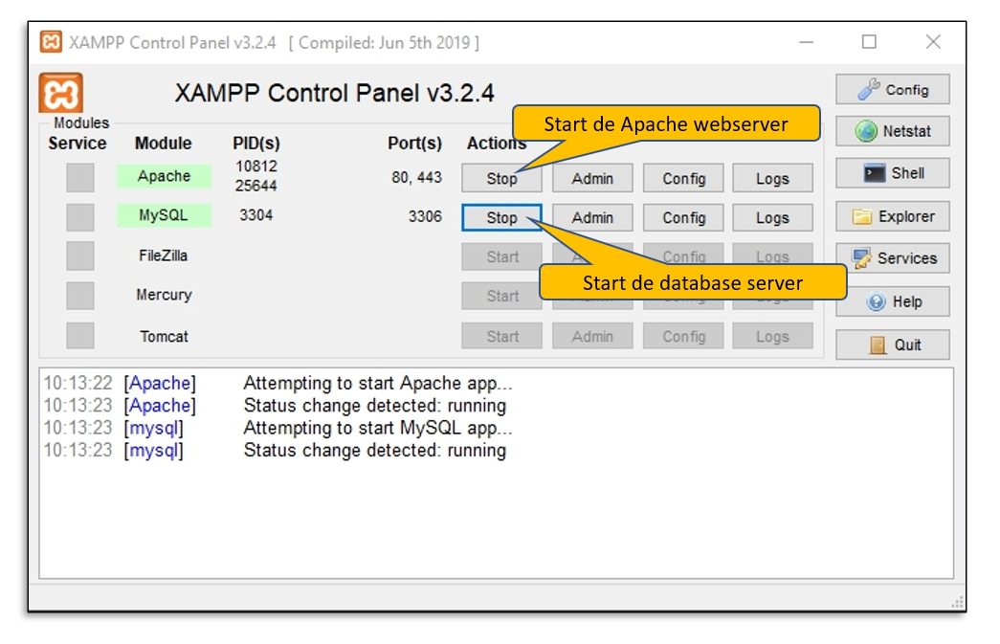
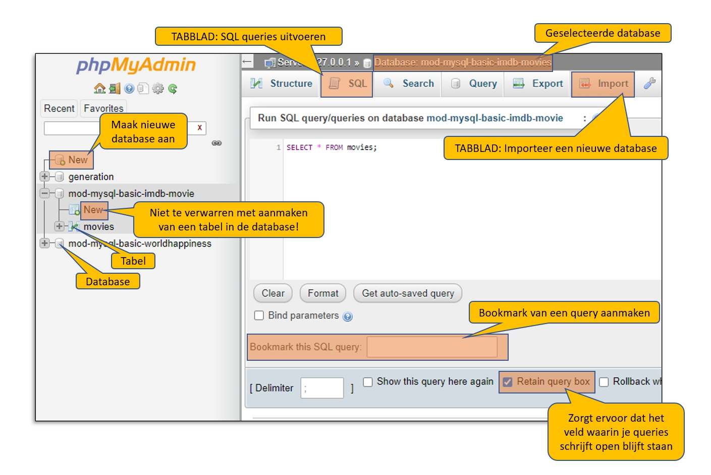

# MYSQL-BASIC-TAAK-01

## Uitleg

### XAMPP

In deze taak wordt uitgelegd hoe je werkt met XAMPP om de Apache webserver en MySQL database server op te starten. Zie onderstaand filmpje (1:42 min) voor een overview van wat XAMPP is. 

Als je XAMPP hebt geinstalleerd dan kun je het XAMPP controlle paneel openen om de Apache webserver en MySQL database server te starten.

> :rocket: **TIP**: de Apache webserver serveert HTML bestanden aan je browser. De MySQL database server zorgt ervoor dat je databases kunt gebruiken. Beiden moeten aan staan om phpMyAdmin te kunnen gebruiken.

### phpMyAdmin

phpMyAdmin is een webapplicatie die je via XAMPP lokaal hebt draaien. We gebruiken phpMyAdmin om databases te beheren. Je zal tijdens de module gevraagd worden om nieuwe databases aan te maken en daarin gegevens te importeren. Daarna zul je voor de verschillende opdrachten SQL statement schrijven om gegevens op te halen of te verwijderen.

:zap: Je opent phpMyAdmin door in je browser te gaan naar `http://localhost/phpmyadmin`  

:rocket: **TIP**: Je kunt ook gewoon `localhost` intypen in je browser. Je komt dan op het XAMPP dashboard. Van daaruit kun je doorklikken naar phpMyAdmin.

In onderstaand plaatje zie je de onderdelen van phpMyAdmin die wij het meest gaan gebruiken. In de komende taken zullen deze onderdelen verder worden toegelicht.

## Leerdoelen

1. Ik kan via het XAMPP Controlepaneel de MySQL-database server opstarten
2. Ik kan via het XAMPP Controlepaneel de Apache-webserver opstarten
3. Ik kan phpMyAdmin openen in een browser

## Opdracht

1. Installeer XAMPP (als je dat nog niet hebt gedaan) en open phpMyAdmin in je browser. 

## Eindresultaat

Je hebt phpMyAdmin geopend in een browser.

## Bronnen

[Xampp download pagina ](https://www.apachefriends.org/index.html)
