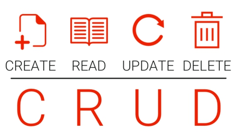
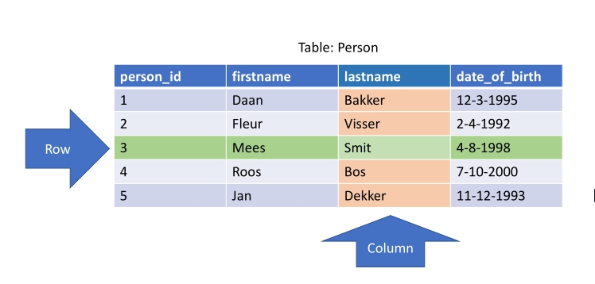
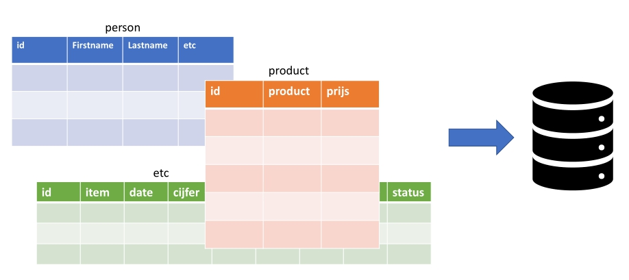

# MYSQL-BASIC

- [MYSQL-BASIC](#mysql-basic)
  - [Uitleg](#uitleg)
    - [Database opbouw](#database-opbouw)
  - [Leerdoelen](#leerdoelen)
  - [Bronnen](#bronnen)

## Uitleg

SQL is een taal die gebruikt wordt voor het manipuleren van gegevens in een database en staat voor Structured Query Language. Een query is een vraag. SQL is dus een taal die jouw als programmeur op een gestructureerde manier vragen laat stellen (aan een database server).

Elk applicatie die je bouwt zal ergens gegevens opslaan, denk hierbij alleen al aan de vele online diensten die allerlei gegevens over de gebruikers opslaan. Bijna altijd gebruikt de applicatie een database op de achtergrond en wordt er gebruik gemaakt van een taal zoals SQL om de gegevens op te slaan of op te halen.  

SQL wordt al gebruikt sinds 1974 en er zijn veel verschillende varianten die gemaakt zijn om een specifieke database aan te spreken (bijvoorbeeld MsSQL, een variant van Microsoft). Wij gebruik de MySQL variant om een MySQL database die wordt meegeleverd met Xampp aan te spreken.

In de basis zijn de dingen die je kan doen met een database te vangen in de onderstaande vier acties ookwel afgekort tot CRUD:  

1. **Create** (nieuwe gegevens toevoegen)
2. **Read** (gegevens ophalen)
3. **Update** (bestaande gegevens aanpassen)
4. **Delete** (gegevens verwijderen)

In deze module leer je de basis van MySQL om gegevens op te halen en te verwijderen. We beperken ons in deze module tot de twee simpelste handelingen: het ophalen van gegevens (READ) en het verwijderen van gegevens (DELETE).

### Database opbouw

Een database zoals MySQL bestaan uit tabellen met daarin gegevens. Gegevens die bij elkaar horen staan samen in een tabel. 
> Zo zal bijvoorbeeld een `users` tabel de namen en wachtwoorden van de gebruikers van een applicatie bevatten.

Elke tabel is opgebouwd uit kolommen (Columns) en rijen (Rows), net zoals je misschien wel kent van een excel spreadsheet.

>Bovenstaande afbeelding toon een voorbeeld van een tabel genaamd `Person` met daarin de informatie van vijf personen. Elke rij bevat dus informatie die bij één enkele persoon hoort. En elke kolom bevat één soort informatie over een persoon.

Een database bevat vaak meerdere tabellen. Zo zie je in onderstaand voorbeeld een tabel `person` met informatie over personen en een tabel `product` met informatie over producten.

MySQL is een zogenaamde *relationele* database. De tabellen in een MySQL database hebben (bijna altijd) een relatie met elkaar. Zo kan het zijn dat een product uit de `product` tabel hoort bij een persoon uit de `person` tabel.

Dit relationele gedeelte komt in latere modules terug, voor nu richten wij ons in deze module op het ophalen en verwijderen van gegevens uit een enkele tabel.

## Leerdoelen

* **00-Voorbereiding**
  * **taak01-XAMPP-en-phpMyAdmin**
    * Ik kan via het XAMPP Controlepaneel de MySQL-database server opstarten
    * Ik kan via het XAMPP Controlepaneel de Apache-webserver opstarten
    * Ik kan phpMyAdmin openen in een browser
* **01-Databases**
  * **taak01-database-import**
    * Ik kan een een databasebestand importeren in een nieuwe database in PhpMyAdmin.
    * Ik kan een SQL-query uitvoeren in PhpMyAdmin
    * Ik kan een uitgevoerde SQL-query bookmarken in PhpMyAdmin
* **02-Select**
  * **taak01-SELECT**
    * Ik kan een SQL-statement schrijven die alle kolommen ophaalt uit een tabel
    * Ik kan een SQL-statement schrijven die alleen bepaalde kolommen ophaalt uit een tabel.
  * **taak02-SELECT-WHERE**
    * Ik kan specifieke rijen ophalen uit een database door een WHERE-clausule toe te voegen aan een SQL-select-statement.
  * **taak03-AND-OR**
    * Ik kan een conditie schrijven die gebruikt wordt binnen een WHERE-clausule.
  * **taak04-Functions-Alias**
    * Ik kan meerdere condities toevoegen aan de WHERE-clausule met de `AND`- en `OR`-keywords.
    * Ik kan de `Count()`-functie gebruiken om het aantal rijen te weten te komen die een query teruggeeft.
    * Ik kan de `SUM()`-functie gebruiken om getallen in een kolom op te tellen
    * Ik kan de `AVG()`-functie gebruiken om het gemiddelde van de getallen in een kolom te berekenen.
    * Ik kan de `ROUND()`-functie gebruiken om een getal af te ronden
    * Ik kan de `Max()` en `Min()` functies gebruiken om de grootste of de kleinste waarde in een kolom op te vragen.
* **03-Delete**
  * **taak01-DELETE**
    * Ik kan een DELETE-statement schrijven met een WHERE-clausule
  * **taak02-Primary-Keys**
    * Ik kan een DELETE-statement schrijven met een WHERE-clausule
    * Ik weet waarom een primary-key-kolom alleen unieke waardes bevat

## Bronnen

